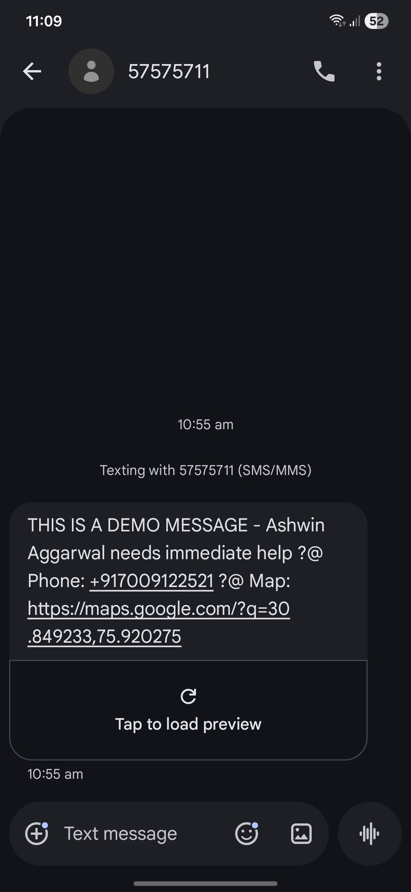

# 🚨 ResQLink

**ResQLink** is a full-stack emergency response platform designed to provide instant assistance during critical situations. Users can manage emergency contacts, trigger SOS alerts, share live location data, and automatically notify designated contacts through SMS-based emergency notifications.

Built with a focus on reliability, accessibility, and real-world usability, ResQLink bridges the gap between emergency situations and immediate communication.


---

## 🌐 Live Deployment

Experience ResQLink in action:

**🔗 Live Application:** `YOUR_DEPLOYMENT_LINK_HERE`

> Note: SMS notifications depend on the configured SMS provider and available API credits.

You are performing a production-readiness, deployment-readiness, and mobile-responsiveness audit of the ResQLink codebase.

IMPORTANT CONSTRAINTS:

* Do NOT rewrite the project architecture.
* Do NOT remove existing functionality.
* Do NOT change business logic unless required to fix bugs.
* Do NOT remove SMS functionality.
* Do NOT introduce breaking changes.
* Do NOT run git push, create pull requests, or perform autonomous git operations.
* Apply fixes directly and explain every modification made.

OBJECTIVE:

Prepare ResQLink for public deployment and real-world usage on desktop and mobile devices while preserving the current user experience and functionality.

==================================================
PHASE 1 — FULL PROJECT AUDIT
============================

Perform a complete audit of:

* Backend
* Frontend
* Authentication
* Routing
* Database usage
* Environment variables
* Mobile responsiveness
* Error handling
* Production deployment readiness

Create a report identifying:

1. Critical Issues
2. Production Risks
3. Mobile UX Issues
4. Security Concerns
5. Deployment Blockers
6. Performance Bottlenecks

==================================================
PHASE 2 — DEPLOYMENT READINESS
==============================

Verify and fix the following:

ENVIRONMENT VARIABLES

Ensure every secret is loaded from environment variables.

No API keys may remain hardcoded.

Create a deployment-safe .env.example file.

Example:

MONGODB_URI=
SESSION_SECRET=
NOTILIFY_API_KEY=
NOTILIFY_SENDER_ID=
PORT=

==================================================

DATABASE CONFIGURATION

Current project uses MongoDB with an in-memory fallback.

Requirements:

* Preserve local in-memory fallback for development.
* Support MongoDB Atlas via MONGODB_URI for production.
* Automatically use Atlas when available.
* Ensure no data loss in production mode.
* Add clear logging showing whether Atlas or in-memory DB is active.

==================================================

PORT CONFIGURATION

Ensure:

const PORT = process.env.PORT || 5000;

No hardcoded ports anywhere else.

==================================================

STATIC ASSET SERVING

Verify:

* Images load correctly.
* CSS loads correctly.
* JS loads correctly.
* All paths work after deployment.

Fix broken relative paths.

==================================================
PHASE 3 — MOBILE RESPONSIVENESS
===============================

Test every page at:

320px
375px
390px
414px
768px
1024px

Audit:

Login Page
Register Page
Dashboard
Profile
Emergency Contacts
Family Network
SOS Alert Screens
Alert History
Mobile Navigation

==================================================

MOBILE FIXES REQUIRED

Buttons:

* Minimum touch size 44px
* No overlapping elements
* No clipped text

Forms:

* Inputs fully visible
* No horizontal scrolling
* Proper spacing

Tables:

* Convert to stacked cards on mobile
* Prevent overflow

Navigation:

* Mobile menu must function correctly
* No inaccessible links

Cards:

* Maintain readability
* Proper padding
* Consistent spacing

Typography:

* No text overflow
* Responsive scaling

==================================================

SOS BUTTON AUDIT

The SOS button is the primary action.

Verify:

* Visible above fold on mobile
* Easily reachable with thumb
* No accidental overlap
* Proper spacing
* Responsive sizing

Do NOT reduce visual prominence.

==================================================
PHASE 4 — FUNCTIONAL TESTING
============================

Test:

User Registration
User Login
Logout
Profile Updates
Emergency Contact CRUD
Family Creation
Family Join
Location Sharing
Alert History
SOS Trigger
SMS Dispatch Logic

Verify each feature still works.

Fix failures.

==================================================
PHASE 5 — ERROR HANDLING
========================

Add production-safe error handling.

Requirements:

* No server crashes on failed requests.
* Graceful API failures.
* Friendly UI messages.
* Handle SMS provider failures.
* Handle location permission denial.
* Handle database connection failures.

==================================================
PHASE 6 — SECURITY HARDENING
============================

Audit:

Authentication
Sessions
Input validation
API endpoints

Add:

* Basic rate limiting
* Helmet middleware
* Input sanitization
* Validation for user-generated data

Do NOT break existing functionality.

==================================================
PHASE 7 — PERFORMANCE
=====================

Identify:

* Unused files
* Duplicate code
* Large assets
* Excessive database calls

Optimize where safe.

==================================================
PHASE 8 — DEPLOYMENT PREPARATION
================================

Prepare the project for Railway deployment.

Create or verify:

package.json start script

Example:

"start": "node server.js"

Verify:

* Railway compatibility
* Atlas compatibility
* Environment variable compatibility
* Production startup compatibility

==================================================
FINAL DELIVERABLE
=================

After completing all work provide:

1. Complete list of files modified.
2. Complete list of issues found.
3. Complete list of issues fixed.
4. Mobile responsiveness report.
5. Deployment readiness report.
6. Railway deployment checklist.
7. Remaining recommended improvements.

Do not stop after reporting issues.
Fix all safe-to-fix issues automatically.
Preserve existing UI design and visual identity while improving responsiveness and production readiness.

---

## 🎥 Demo Video

[▶️ Watch Full Demo](https://youtu.be/fG26f5-OScQ)

---

## ✨ Key Features

### 🆘 Smart SOS Alert System

* One-click emergency alert activation
* Automatic SMS notification dispatch
* Real-time location sharing through Google Maps links
* Alert history tracking and logging

### 👥 Emergency Contact Management

* Add, edit, and remove emergency contacts
* Personal emergency contact network
* Dedicated contact management dashboard

### 📍 Live Location Sharing

* Captures the user's current location during an SOS event
* Generates a Google Maps link for responders
* Enables faster emergency response

### 👨‍👩‍👧 Family Safety Network

* Create private family groups
* Join using secure invite codes
* Family member synchronization
* Location sharing controls

### 🔐 User Management

* Secure authentication system
* User profile management
* Medical information storage
* Blood group and emergency details management

### 📜 Alert History

* Complete timeline of previous SOS alerts
* Timestamped emergency records
* Activity tracking and review

---

## 🚀 How the SOS System Works

```text
User Presses SOS
        ↓
User Authenticated
        ↓
Emergency Contacts Retrieved
        ↓
Current Location Captured
        ↓
SOS Message Generated
        ↓
SMS Notifications Sent
        ↓
Alert Stored in History
```

### Example SMS

```text
🚨 RESQLINK SOS ALERT

Ashwin Aggarwal needs immediate help.

Phone: +91XXXXXXXXXX

Map:
https://maps.google.com/?q=latitude,longitude
```

---

## 📱 SMS Alert Proof

<p align="center">
  
</p>

---

## 🛠 Tech Stack

**Frontend:** HTML5, CSS3, JavaScript, Tailwind CSS

**Backend:** Node.js, Express.js

**Database:** MongoDB, Mongoose

**APIs & Services:** Notilify SMS API, Browser Geolocation API, Google Maps Location Links

**Authentication:** Session-Based Authentication, Express Middleware

---

## 📂 Project Structure

```bash
ResQLink/
│
├── backend/
│   ├── routes/
│   ├── models/
│   ├── middleware/
│   ├── services/
│   └── server.js
│
├── frontend/
│   ├── css/
│   ├── js/
│   └── pages/
│
├── Proof.jpg
│
└── README.md
```

---

## ⚙️ Installation

### Clone Repository

```bash
git clone https://github.com/ashwinagg3/ResQLink.git
cd ResQLink
```

### Install Dependencies

```bash
cd backend
npm install
```

### Configure Environment Variables

Create a `.env` file inside the backend directory:

```env
NOTILIFY_API_KEY=YOUR_API_KEY
NOTILIFY_SENDER_ID=YOUR_SENDER_ID
```

### Start Server

```bash
node server.js
```

Application will run at:

```text
http://localhost:5000
```

---

## 📸 Core Functionalities

✅ User Registration & Login

✅ Emergency Contact Management

✅ Family Safety Network

✅ Live Location Tracking

✅ SOS Alert System

✅ SMS Emergency Notifications

✅ Alert History Logging

✅ Responsive Mobile Interface

---

## 🔮 Future Enhancements

* Push Notifications
* WhatsApp Emergency Alerts
* Email Fallback Notifications
* Emergency Contact Verification
* Real-Time Family Location Dashboard
* Mobile Application Version

---

## 🎯 Motivation

ResQLink was built to explore how modern web technologies can be combined with real-world emergency communication systems. The project focuses on reducing response time during emergencies by enabling users to instantly notify trusted contacts with actionable location information.

---

## 👨‍💻 Developer

**Ashwin Aggarwal**

Built as a full-stack safety and emergency response solution combining location intelligence, contact management, and automated emergency notifications.
